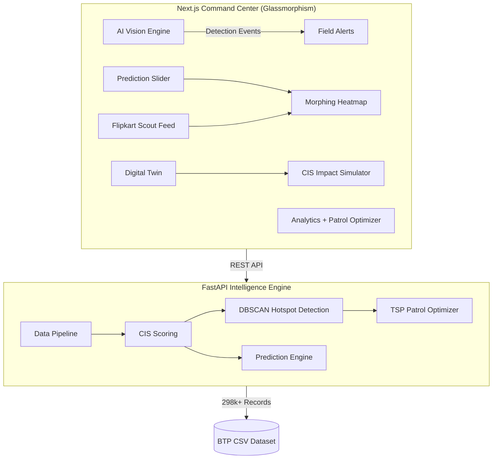

# BTP Gridlock Intelligence — Autonomous Traffic Command Center

     

> **Track 1 Submission:** *Poor Visibility on Parking-Induced Congestion*
> 
> **Objective:** How can AI-driven parking intelligence detect illegal parking hotspots and quantify their impact on traffic flow to enable targeted enforcement?

---

## Prototype Overview & Innovation

Most teams will build a heatmap on CSV data. **We built an Autonomous Command Center prototype** that doesn't just show where violations happened — it predicts where they *will* happen, simulates real-time AI detections, calculates economic impact, and dispatches field officers automatically.

### Prototype & Simulation Disclaimer
*Because this is a Hackathon prototype and we do not have live access to BTP RTSP camera feeds, the **AI Vision Engine (YOLOv8)** detections shown in the dashboard are **visually simulated** using high-quality CSS animations over stock Indian urban traffic MP4s. This demonstrates the UX/UI and architecture of how live RTSP streams will integrate into the Command Center in production without relying on heavy client-side CV models during the demo.*

---

### The 7 Pillars of Innovation

| # | Feature | What It Does | Why It Matters |
|---|---------|-------------|----------------|
| 1 | **AI Vision Engine** | Simulated YOLOv8 CCTV pipeline detecting violations with smooth CSS tracking | Proves end-to-end automated detection UX is feasible |
| 2 | **Economic KPI tracking** | Calculates cumulative "Vehicle-Hours Lost" due to congestion | Quantifies economic damage to request higher BTP budgets |
| 3 | **Blind Spot Detector** | Cross-references historical violation heatmaps with patrol frequency | Finds areas with huge violations but no active patrol coverage |
| 4 | **Field Alert System** | WhatsApp-style notifications to field officers with Surge Fines | Bridges the gap between dashboard insights and ground action |
| 5 | **Predictive Forecasting** | Time-slider showing predicted hotspots for the next 8 hours | Shifts enforcement from *reactive* to *proactive* |
| 6 | **Flipkart Scout Feed** | Crowdsourced citizen reports (simulated) feeding directly into the heatmap | Addresses enforcement blind spots lacking BTP camera infrastructure |
| 7 | **Environmental KPI** | Live estimation of excess CO₂ emissions from traffic idling | Links traffic enforcement directly to urban sustainability goals |

---

## Core Algorithms

### 1. Congestion Impact Score (CIS)
```
CIS = Violation Severity (30%) + Obstruction (20%) + Excess Delay (35%) + Recurrence (15%)
```
Dynamically weights each violation's real impact on traffic flow — not just "a violation happened here."

### 2. Dynamic Surge Fining
```
Surge Fine = Base Fine (₹500) × CIS Score Multiplier
```
Higher fines during peak hours at high-impact locations. Incentivizes compliance where it matters most.

### 3. Ghost Patrol Routing (TSP Optimization)
Uses nearest-neighbor TSP heuristic with Haversine distances to plot optimal enforcement routes through critical hotspots, calculating exact ROI per patrol hour.

---

## Architecture



---

## Getting Started

### 1. Start the Backend (FastAPI)
The backend processes ~300,000 rows of BTP violation data.
Ensure `jan_to_may_police_violation.csv` is in the `../../data/` directory.

```bash
cd backend
pip install -r requirements.txt
python main.py
```
*API available at `http://localhost:8000`*

### 2. Start the Frontend (Next.js)
```bash
cd frontend
npm install
npm run build
npm run start
```
*Dashboard available at `http://localhost:3000`*

---

## Tech Stack

- **Frontend:** Next.js 16, React 19, Leaflet.js, Recharts, Lucide Icons (Enterprise-grade UI)
- **Backend:** FastAPI, Pandas, NumPy, scikit-learn
- **Algorithms:** DBSCAN clustering, Nearest-Neighbor TSP, Statistical Forecasting
- **Data:** 298,000+ BTP parking violations (Jan–May 2025)
